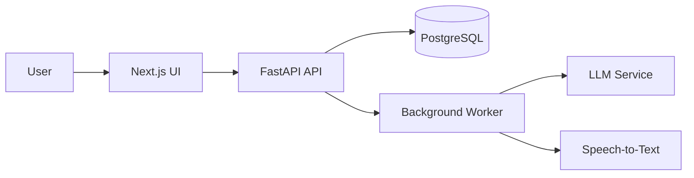

# Overview

## What to write

Explain your project system in plain language and show the main moving parts.

## Why it matters

A strong overview helps everyone understand the architecture quickly.

## Example

The product uses a lightweight API layer to process meeting audio, a summarization service to turn transcripts into structured output, and a database to store meeting metadata and notes.

---

# Folder Structure

## What to write

Show the high-level layout of the codebase.

## Why it matters

A clear folder layout reduces onboarding friction.

## Example

```text
src/
  api/
  services/
  models/
  db/
  workers/
  ui/
```

---

# Backend

## What to write

Describe the server side responsibilities and core modules.

## Why it matters

The backend usually defines the system boundaries and important integrations.

## Example

FastAPI handles request routing, transcription jobs, and summary generation. Background workers process long-running tasks asynchronously.

---

# Frontend

## What to write

Describe the user interface and its main flows.

## Why it matters

The frontend should reflect the real product experience, not just the backend structure.

## Example

A Next.js dashboard lets users upload recordings, review generated summaries, and search historical meetings.

---

# Database

## What to write

Describe the persistence layer and the most important data entities.

## Why it matters

Database decisions affect performance, reliability, and future growth.

## Example

PostgreSQL stores users, meetings, transcripts, generated summaries, and action items.

---

# APIs

## What to write

List the main interfaces used internally and externally.

## Why it matters

Good API documentation reduces integration mistakes.

## Example

- `POST /meetings` creates a new meeting job
- `GET /meetings/{id}` retrieves meeting results
- `POST /summaries/refresh` regenerates a summary from a transcript

---

# External Services

## What to write

List the third-party services/tools involved in the system.

## Why it matters

External dependencies should be visible and reviewed carefully.

## Example

- Speech-to-text provider for transcription
- LLM provider for summarization
- Email provider for notifications

---

# Deployment

## What to write

Describe how the system is deployed and run in production.

## Why it matters

Deployment choices affect reliability and maintainability.

## Example

The application is containerized with Docker and deployed to a managed Kubernetes environment with separate staging and production namespaces.

---

# Future Scaling

## What to write

Explain how the architecture will evolve if usage grows.

## Why it matters

A scalable architecture plan prevents painful rewrites later.

## Example

Introduce queue-based job partitioning, read replicas, and a dedicated vector search service as usage grows.

---

# Key Decisions

Document the important choices that shape the architecture.

## Template

### Date

YYYY-MM-DD

### Decision

Describe the choice that was made.

### Reason

Explain why this decision was taken.

### Tradeoffs

List the costs or limitations of the decision.

### Alternatives

List the options that were considered.

### Status

Accepted, rejected, or pending.

## Example

### Date

2026-07-01

### Decision

Use PostgreSQL as the primary relational database.

### Reason

The product needs reliable relational queries for users, meetings, and action items.

### Tradeoffs

Local setup is a bit heavier than using a document store.

### Alternatives

- SQLite for faster local development
- MongoDB for a more document-oriented model

### Status

Accepted

---

# Architecture Diagram


